  

## 📊 GitHub Stats & Trophies

  
  

  

## 🛠️ Languages & Tools

<h3 align="center">Programming Languages</h3>

  
  
  
  

<h3 align="center">Frontend</h3>

  
  

<h3 align="center">Backend</h3>

  
  

<h3 align="center">Database</h3>

  
  
  

<h3 align="center">Tools</h3>

  
  

 

# 🌐 Connect With Me

